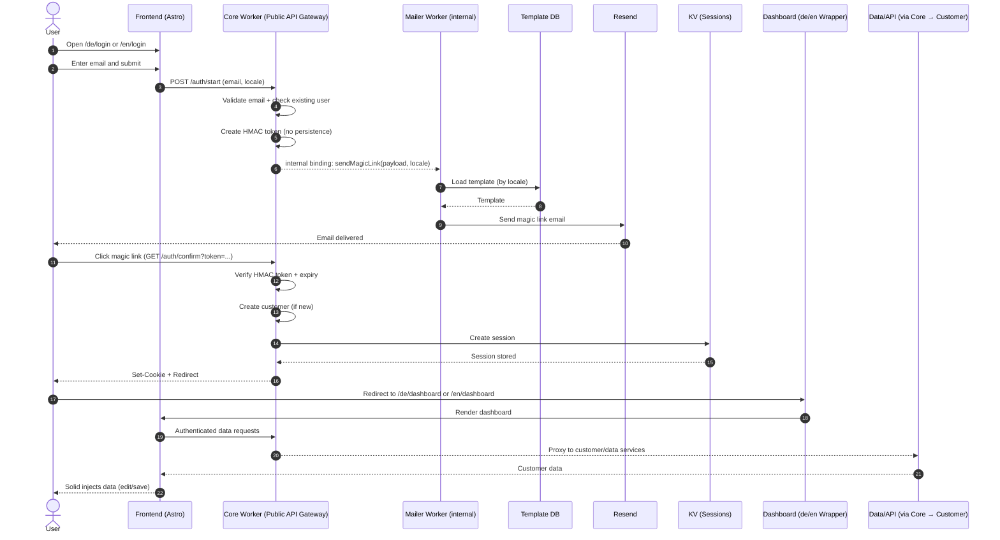

# SmartPages – Login Flow (DE)

> **Ziel dieses Dokuments**  
> Verständliche Darstellung des tatsächlichen Login- und Session-Flows in SmartPages.  
> Fokus: **Token-Handling, Session-Erstellung, Sprache (de/en) und Datenfluss**.

---

## Wichtige Klarstellungen

- **Kein Kunde / keine Daten werden vor dem Magic-Link-Klick gespeichert**
- Der **Kunde wird erst nach erfolgreicher Token-Bestätigung** angelegt
- Die **Sprache (de/en)** wird vom Startpunkt (Login-Seite) mitgeführt
- **Token ≠ Session** (Session entsteht erst nach Klick)

---

## Login-Flow (Schritt für Schritt)

1. **User öffnet Login-Seite (de oder en)**  
   Der User startet z. B. auf `/de/login` oder `/en/login`. Die Sprache wird im Request-Kontext gehalten.

2. **Formular-Submit → Core Worker**  
   Das Frontend sendet die Daten an den Core Worker (`/auth/start`).

3. **Vorprüfung im Core Worker**  
   - E-Mail-Validierung
   - Prüfung, ob der User bereits existiert
   - **Keine Speicherung von User- oder Kundendaten**

4. **Erstellung des HMAC Magic-Link-Tokens**  
   - Zeitlich begrenzt
   - Signiert (HMAC)
   - Sprache (de/en) wird im Token oder Payload mitgeführt

5. **Mailer Worker versendet Magic Link**  
   - Core übergibt Payload per interner Dienstbindung
   - Mailer lädt passendes Template (nach Sprache)
   - Versand über Resend

6. **Magic-Link-Klick → Bestätigung im Core Worker**  
   - Token-Verifikation (HMAC + Ablauf)
   - **Erst jetzt:**
     - Anlegen eines neuen Kunden (falls nicht vorhanden)
     - Initialisierung der Kundendaten

7. **Session-Erstellung**  
   - Session wird in KV gespeichert
   - Secure Cookie wird gesetzt
   - Middleware ist sofort synchron (gleiche Session-Quelle)

8. **Redirect ins passende Dashboard**  
   - Automatisch nach `/de/dashboard` oder `/en/dashboard`
   - Wrapper leitet intern auf `/dashboard`

9. **Daten-Injektion im Dashboard**  
   - Authentifizierte Requests über Core Worker
   - Kundendaten werden geladen
   - Solid injiziert Daten in die UI
   - User kann Daten direkt bearbeiten und speichern

---

## Login-Flow Diagramm

---

## Sicherheits- & Architekturhinweise

- Keine persistente Speicherung vor Token-Bestätigung
- Token ist einmalig und zeitlich begrenzt
- Session-Zustand liegt zentral in KV
- Sprache ist Teil des Auth-Kontexts

---

**Status:** Final · Referenz-Login-Flow (DE)

