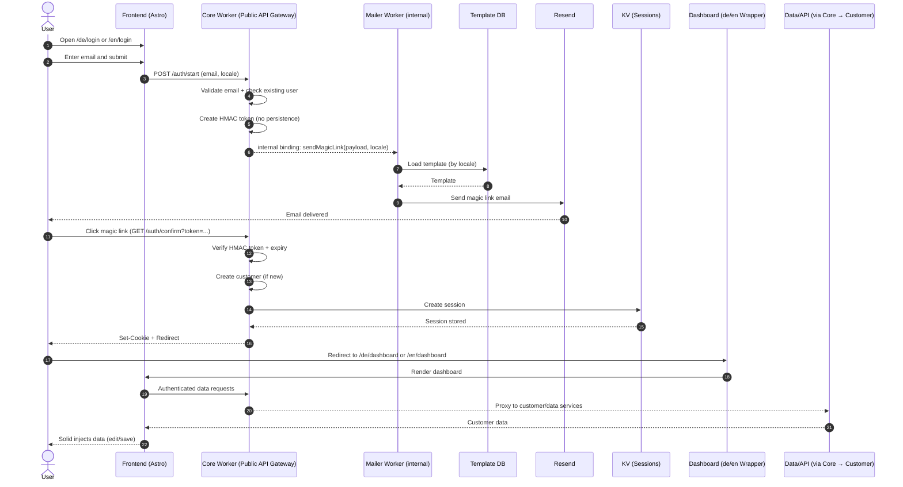

# SmartPages – Login Flow (EN)

> **Purpose of this document**  
> Clear description of the actual login and session flow in SmartPages.  
> Focus: **token handling, session creation, locale (de/en), and data flow**.

---

## Key Clarifications

- **No customer or user data is persisted before the magic link is confirmed**
- A **new customer is created only after successful token verification**
- The **locale (de/en)** is propagated from the initial login page
- **Token ≠ Session** (session is created only after confirmation)

---

## Login Flow (Step by Step)

1. **User opens login page (de or en)**  
   The user starts on `/de/login` or `/en/login`. The locale is preserved throughout the flow.

2. **Form submit → Core Worker**  
   The frontend sends the login request to the Core Worker (`/auth/start`).

3. **Pre-validation in Core Worker**  
   - Email validation
   - Check if user already exists
   - **No persistence of customer data**

4. **HMAC magic-link token creation**  
   - Time-limited token
   - HMAC-signed (tamper-proof)
   - Locale (de/en) included in token or payload

5. **Mailer Worker sends magic link**  
   - Core calls Mailer Worker via internal service binding
   - Mailer loads the correct template (by locale)
   - Email is sent via Resend

6. **Magic link click → confirmation in Core Worker**  
   - Token verification (HMAC + expiry)
   - **Only now:**
     - Create new customer if not existing
     - Initialize customer data

7. **Session creation**  
   - Session is stored in KV
   - Secure cookie is set
   - Middleware immediately recognizes the session

8. **Redirect to the correct dashboard**  
   - Automatically to `/de/dashboard` or `/en/dashboard`
   - Wrapper internally resolves to `/dashboard`

9. **Data injection in the dashboard**  
   - Authenticated requests via Core Worker
   - Customer data is loaded
   - Solid injects data into the UI
   - User can edit and save data directly

---

## Login Flow Diagram

---

## Security & Architecture Notes

- No persistent data before token confirmation
- One-time, time-limited magic link tokens
- Centralized session state in KV
- Locale is part of the authentication context

---

**Status:** Final · Reference Login Flow (EN)

